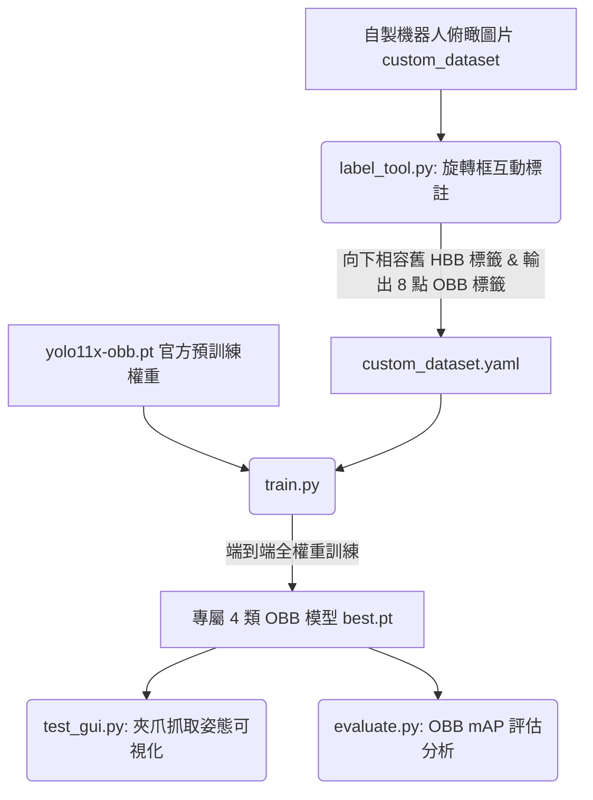

# AI Robotics - Garbage Classification & Grasping (YOLOv11-OBB)


這是一個專為**機器手臂夾爪 (Parallel Gripper)** 設計的 **YOLOv11-OBB (Oriented Bounding Box，旋轉邊界框)** 垃圾辨識與抓取姿態預測系統。

系統直接在機器人真實俯瞰視角（鳥瞰、純黑桌面）上進行端到端訓練，並輸出帶有**平面旋轉姿態角度 ($\text{Yaw}, \theta$)**、中心抓取點與長短軸的邊界框，提供機械手臂最即時且精準的抓取資訊。

---

## 專案工作流程 (Workflow)



---

## 專案分類與抓取邏輯

模型輸出為機器手臂夾取的 4 大分類：
- `0: plastic` (塑膠)
- `1: metal` (金屬)
- `2: paper` (紙類)
- `3: general_waste` (一般垃圾)

對於長條形物體（寶特瓶、鐵罐、紙盒），模型預測出精準的 OBB 角度，夾爪直接垂直於長軸閉合；對於球狀/不規則形狀（如揉成一團的紙球），任意角度皆可抓取。

---

## 環境與安裝

1. **建立虛擬環境**
```bash
python3 -m venv .venv
source .venv/bin/activate  # Linux / macOS
# Windows: .venv\Scripts\activate
```

2. **安裝依賴套件**
```bash
pip install -r requirements.txt
```

---

## 核心工具與操作說明

### 1. 旋轉框標註與檢查工具 ([`label_tool.py`](label_tool.py))
專為機器人夾取任務打造的互動式 OBB 標註軟體，支援既有標籤無損讀入與即時旋轉編輯。
```bash
python label_tool.py
```
- **向下相容**：自動將舊有的 5 欄位水平標籤 (HBB) 載入為初始角度為 $0^\circ$ 的矩形。
- **選取框**：滑鼠左鍵點選框，顯示黃色旋轉手把與角落/邊緣拉伸節點。
- **旋轉角度**：
  - 拖曳頂部**黃色旋轉手把**。
  - 選取狀態下滾動**滑鼠滾輪**（或按 `R` / `E` / `[` / `]`）。
- **長寬拉伸**：拖曳角落或邊緣小方塊（嚴格維持 90 度矩形幾何）。
- **切換類別**：按鍵盤數字鍵 `0` ~ `3` 即時切換。
- **刪除標籤**：按鍵盤 `Delete` / `Backspace` / `X` 或滑鼠右鍵點擊。
- **切換資料集**：按 `T` 鍵可在 `train` 與 `test` 資料夾間無縫切換。
- **換頁與儲存**：`A` (上一張), `D` / `Space` (下一張並自動儲存), `Q` (儲存退出)。

### 2. 端到端 OBB 訓練 ([`train.py`](train.py))
直接以 `yolo11x-obb.pt` 為基底，在 `custom_dataset` 進行 300 輪全權重訓練。
```bash
python train.py
```

### 3. 圖形化推論與夾爪姿態測試 ([`test_gui.py`](test_gui.py))
即時預測 OBB 旋轉框，支援跨類別 Agnostic NMS 消除重複，並可視化展示夾爪抓取輔助線與角度文字（Yaw $\theta$）。
```bash
python test_gui.py
```

### 4. 模型評估與 mAP 分析 ([`evaluate.py`](evaluate.py))
自動檢測模型為 OBB 或 HBB，並在測試集上計算 Precision, Recall, mAP@50 與 mAP@50-95。
```bash
python evaluate.py
```

### 5. 展示動圖產生器 ([`make_demo_gif.py`](make_demo_gif.py))
一鍵將測試集預測結果輸出為每幀 1 秒的高畫質展示動圖 `demo.gif`。
```bash
python make_demo_gif.py
```

---

## 授權聲明 (License)
- 本專案程式碼採用 MIT License 授權。
- 資料集標註採用 CC BY 4.0 授權。
