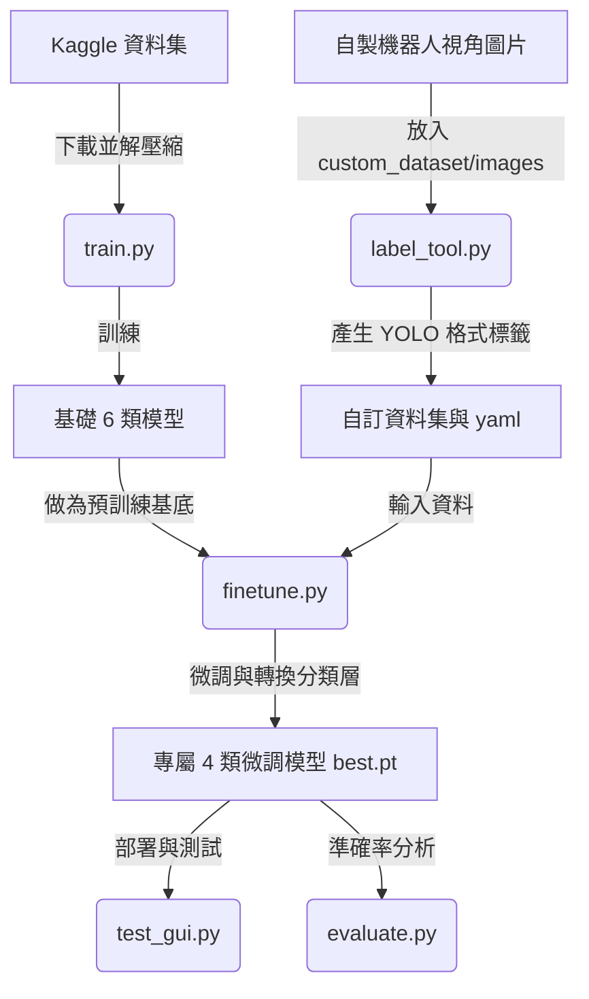

# AI Robotics - Garbage Classification (YOLOv11)

這是一個專為機器手臂夾取與分類系統設計的 YOLOv11x 垃圾辨識模組。專案包含了從底層訓練、資料標註、到視角微調 (Fine-tuning) 的完整開發流程。

## 專案工作流程 (Workflow)

剛接觸本專案的新手，請參考以下工作流程圖，了解各腳本之間的協作關係：



## 專案架構與分類邏輯

本專案採用「兩階段訓練」策略，以克服開源資料集與實際機器人視角間的環境落差 (Domain Gap)：

1. 基礎模型 (6大類)
利用 Kaggle 大型資料集進行初步訓練，建立模型對垃圾紋理與反光的基礎認知。
類別：BIODEGRADABLE(廚餘), CARDBOARD(紙板), GLASS(玻璃), METAL(金屬), PAPER(紙張), PLASTIC(塑膠)。

2. 機器人專屬微調模型 (4大類)
使用符合機器人真實視角（正上方鳥瞰、純黑桌面）的自訂資料集進行微調 (Fine-tuning)。
最終輸出類別：plastic(塑膠), metal(金屬), paper(紙類), general_waste(一般垃圾)。

## 環境與安裝

1. 建立虛擬環境
```bash
python3 -m venv .venv
source .venv/bin/activate  # Linux/macOS
# Windows: .venv\Scripts\activate
```

2. 安裝依賴套件
```bash
pip install -r requirements.txt
```

## 資料準備與權重

1. 模型權重 (Weights)
最終微調完成的 `best.pt` 已透過 Git LFS (Large File Storage) 進行版本控制。
請確保您的環境有安裝 Git LFS，在 `git clone` 時模型檔案會自動下載至根目錄。

2. 基礎資料集
由於體積龐大，原始訓練集並未包含在 Repo 中。若需從零訓練，請自行下載：
來源：[Kaggle - Garbage Detection (viswaprakash1990)](https://www.kaggle.com/datasets/viswaprakash1990/garbage-detection)

## 核心工具與腳本

### 1. 資料標註與審查工具 (label_tool.py)
專為本專案打造的輕量化標註軟體，用於標註機器人專屬視角的圖片。
```bash
python label_tool.py
```
- 自動讀取 custom_dataset/images 內的圖片。
- 滑鼠拖曳畫框，按鍵盤 0~3 快速賦予標籤。
- 支援讀取並顯示已標註的框，滑鼠點擊即可刪除錯誤標籤。

### 2. 模型微調 (finetune.py)
將基礎 6 類模型轉換為 4 類模型的微調腳本。內部已實作「凍結骨幹網路 (Freeze Backbone)」與「學習率優化」，確保小資料訓練的穩定性。
```bash
python finetune.py
```

### 3. 圖形化推論測試 (test_gui.py)
內建 Agnostic NMS 機制（消除跨類別重複框）的視覺化測試介面。
```bash
python test_gui.py
```

### 4. 模型評估 (evaluate.py)
計算並列印出模型在測試集上的詳細效能指標 (Precision, Recall, mAP)。
```bash
python evaluate.py
```

### 5. 基礎訓練 (train.py)
從頭訓練 6 類基礎模型的腳本。
預設 batch=32（針對大容量 VRAM 優化）。若顯卡記憶體不足，請調低此數值。

## 授權聲明 (License)
本專案程式碼採用 MIT License 授權。
資料集標註採用 CC BY 4.0 授權。
